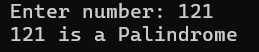

# 🔁 Palindrome Number Checker in C

A simple yet effective C program that checks whether a given number is a **palindrome**. A palindrome is a number that reads the same forward and backward, such as `121`, `1331`, or `777`.

---

## 📌 Overview

This program:
- Accepts an integer input from the user.
- Reverses the digits of the number.
- Compares the reversed number with the original.
- Prints whether the number is a palindrome.

---

## 🛠️ Technologies Used

- **Language**: C
- **Compiler**: GCC
- **Environment**: Linux / Windows (with MinGW or compatible terminal)

---

## ▶️ How to Run

### 1. **Save the code**
Save the file as `palindrome_checker.c`

### 2. **Compile**

For Linux / macOS:
```bash
gcc palindrome_checker.c -o palindrome_checker
```

On Windows (with MinGW installed):
```bash
gcc palindrome_checker.c -o palindrome_checker.exe
```
3️⃣ Run It
On Linux/macOS:
```bash
./palindrome_checke
```

On Windows:
```bash
palindrome_checker.exe
```

---

## 🧪 Example Output


---

## ✍️ Author
**S.D.Tasuntha Chathunika** 
🎓 University of Vavuniya – Faculty of Information and Communication Technology  
📅 Date: 2025-06-09
🔗 [GitHub Profile](https://github.com/Tasuntha-Chathunika)